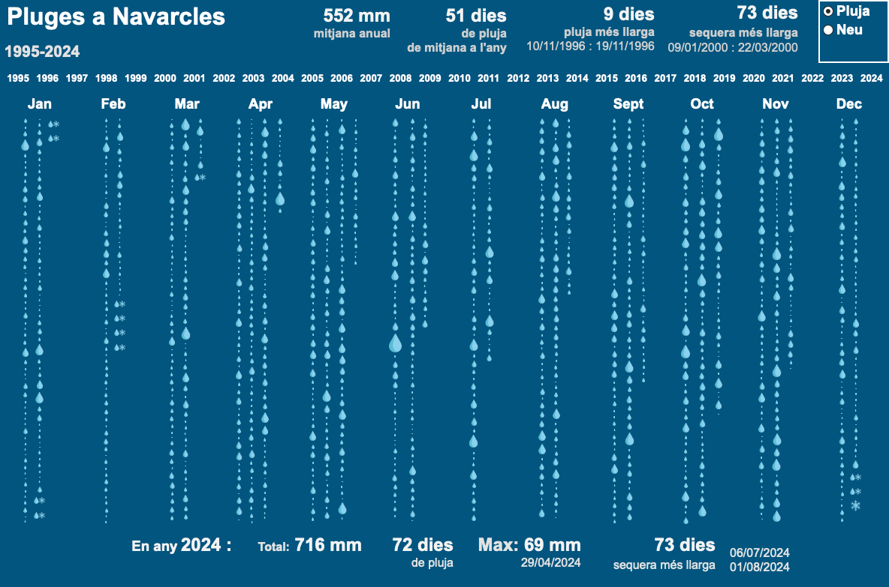

# 🌧️ Rainfalls in Navarcles: Visualization and Forecasting

## Project Overview

This project explores 30 years of rainfall data in **Navarcles**, a municipality in Catalonia, Spain. It combines **time series forecasting** techniques with **interactive data visualization** to both analyze historical precipitation and try to predict future rainfall.

The project has two key goals:
1. **Create a public dashboard** in Tableau to make precipitation trends accessible to residents and local authorities.
2. **Forecast monthly rainfall** using time series models (SARIMA, SARIMAX, Prophet, Auto-ARIMA) and machine learning models (LightGBM, CatBoost, ElasticNet).

## Repository Structure
The project is organized into the following folders:
- **`data/`** – Raw and processed data files</summary>
- **`script/`** – Jupyter notebooks for analysis</summary>
- **`results/`** – Project deliverables</summary>

## Key Features

- **Private rainfall dataset (1995–2024)** manually recorded in Navarcles.
- **Comparison of multiple forecasting models** including SARIMA, SARIMAX, Prophet, LightGBM, CatBoost, and ElasticNet.
- **External regressors** (temperature, insolation, lagged rainfall, etc.) explored for enhanced accuracy.
- **Interactive dashboard** developed with Tableau (Public Edition) for public engagement.
- **Python-based data pipeline**, including preprocessing, stationarity tests, ACF/PACF analysis, and time series cross-validation.

## Requirements

To run the Jupyter notebooks:

- Python 3.10+
- JupyterLab 4.2+
- Install dependencies from `requirements.txt`
  
```bash
pip install -r requirements.txt
```

---

## Methodology Summary

- **Data Preprocessing**:
  - Manual dataset cleaned and merged with Manresa data
  - Monthly aggregation and missing value imputation

- **Stationarity & Seasonality**:
  - ADF test, ACF/PACF, seasonal decomposition

- **Modeling Approaches**:
  - SARIMA, Auto-ARIMA, SARIMAX
  - Prophet, ElasticNet, LightGBM, CatBoost

- **Validation Strategy**:
  - Time-series cross-validation
  - Mean Absolute Error (MAE) as the evaluation metric

- **External Regressors Tested**:
  - Temperature, insolation, rainfall stats, lagged features

---

## Dashboard Preview

The interactive dashboard allows users to explore 30 years of rainfall and snowfall data in Navarcles by year and month.



Dashboard includes:

- **Annual Analysis**:
  - Mean annual rainfall
  - Rainiest/driest years
  - Longest wet/dry periods

- **Monthly View**:
  - Number of rainy days
  - Monthly extremes and totals

- **Snowfall Tracking**:
  - Historical snow event comments

- **User Controls**:
  - Filter by year
  - Explore trends with dropdowns and charts

> Open `Dashboard_Navarcles.twbx` with **Tableau Desktop Public Edition (v2022.3+)**

---

## Forecasting Summary
The best-performing model was **Auto-ARIMA**, achieving a test MAE of 29.19 mm.

| Model          | Avg. MAE (CV) |
|----------------|---------------|
| **Auto-ARIMA** | **29.35**     |
| Prophet        | 29.72         |
| SARIMA         | 32.80         |
| SARIMAX        | 30.63         |
| LightGBM       | 30.98         |
| CatBoost       | ~31.12        |
| Constant Model | ~31.00        |

> Final test MAE of Auto-ARIMA: **29.19 mm**

---

## Future Work

- [ ] Add reanalysis or satellite-based weather features
- [ ] Investigate deep learning models (e.g., LSTM, Temporal Fusion Transformer)
- [ ] Deploy dashboard online for public access
- [ ] Collaborate with local authorities for real-time data updates

---

## License

This project is intended for **educational and non-commercial use**.  
Please credit the author and repository if reusing parts of the methodology or data.

---

## Acknowledgments

This project is dedicated to the memory of **Carmel Puig Vilaragut**, who faithfully recorded daily rainfall and snowfall in Navarcles until his passing in 2020. His decades-long commitment to data collection created a rare and invaluable dataset, although handwritten notes from before 1995 were unfortunately lost. Since 2020, our family has proudly continued the tradition to ensure the continuity of this local climate record. We are grateful for his legacy and hope this work honors his efforts and benefits the wider community.
